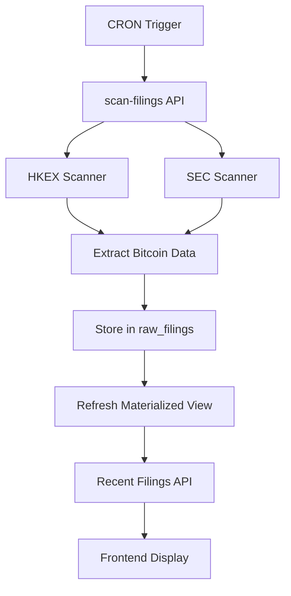

# Bitcoin Treasuries Scraper System Guide

This guide provides comprehensive information about running the scraping system that powers the Bitcoin treasuries tracking platform.

## Overview

The system consists of multiple scrapers that monitor regulatory filings from various exchanges (HKEX, SEC) and extract Bitcoin-related information. It operates through:

- **Automated CRON jobs** - Run every 2 hours
- **Manual triggers** - CLI commands and admin interfaces
- **Supabase Edge Functions** - Serverless scrapers
- **Next.js API Routes** - Web-accessible endpoints
- **Scripts** - Standalone utilities

## Environment Variables Required

Before running any scrapers, ensure these environment variables are set:

```bash
# Supabase Configuration
NEXT_PUBLIC_SUPABASE_URL=your_supabase_project_url
NEXT_PUBLIC_SUPABASE_ANON_KEY=your_supabase_anon_key
SUPABASE_SERVICE_ROLE_KEY=your_supabase_service_role_key

# Security
FILING_CRON_SECRET=your_secret_for_cron_auth

# Application
NEXT_PUBLIC_APP_URL=http://localhost:3000  # or your production URL

# Optional: Market Data APIs
TWELVE_DATA_API_KEY=your_twelve_data_key
YAHOO_FINANCE_API_KEY=your_yahoo_finance_key
```

## CLI Commands

### 1. Manual Filing Scan (All Sources)

**Using curl (recommended for automation):**
```bash
# Scan both HKEX and SEC filings
curl -X POST "http://localhost:3000/api/admin/scan-filings" \
  -H "Content-Type: application/json"
```

**Production:**
```bash
curl -X POST "https://yourdomain.com/api/admin/scan-filings" \
  -H "Content-Type: application/json"
```

### 2. HKEX-Only Scan

**Using Supabase CLI:**
```bash
# Direct edge function call (requires local Supabase running)
npx supabase functions invoke scan-hkex-filings

# Or serve functions locally first, then invoke
npx supabase functions serve &
curl -X POST "http://localhost:54321/functions/v1/scan-hkex-filings"
```

**Using curl:**
```bash
curl -X POST "https://your-project.supabase.co/functions/v1/scan-hkex-filings" \
  -H "Authorization: Bearer $SUPABASE_ANON_KEY" \
  -H "Content-Type: application/json"
```

### 3. SEC-Only Scan

```bash
# Edge function (local)
npx supabase functions invoke scan-sec-filings

# Or via curl (production)
curl -X POST "https://your-project.supabase.co/functions/v1/scan-sec-filings" \
  -H "Authorization: Bearer $SUPABASE_ANON_KEY" \
  -H "Content-Type: application/json"
```

### 4. Market Data Updates

**Update market caps:**
```bash
# Run the TypeScript script
npx tsx scripts/update-market-caps.ts

# Or use the API endpoint
curl -X POST "http://localhost:3000/api/admin/update-market-data"
```

**Manual market data refresh:**
```bash
curl -X POST "http://localhost:3000/api/admin/manual-market-update"
```

### 5. Database Operations

**Check database status:**
```bash
node scripts/check-database.js
```

**Push database migrations:**
```bash
npx supabase db push
```

**Refresh materialized view:**
```bash
# Via SQL in Supabase dashboard
SELECT refresh_recent_hkex_filings();

# Or check recent filings endpoint
curl "http://localhost:3000/api/filings/recent/hkex"
```

## API Endpoints

### Admin Endpoints (Manual Triggers)

| Endpoint | Method | Purpose | Response Time |
|----------|--------|---------|---------------|
| `/api/admin/scan-filings` | POST | Scan all sources (HKEX + SEC) | 30-60s |
| `/api/admin/parse-hkex` | POST | Parse specific HKEX documents | 10-30s |
| `/api/admin/update-market-data` | POST | Update stock prices & market caps | 15-45s |
| `/api/admin/manual-market-update` | POST | Force market data refresh | 10-20s |

### CRON Endpoints (Automated)

| Endpoint | Method | Schedule | Purpose |
|----------|--------|----------|---------|
| `/api/cron/scan-filings` | GET/POST | Every 2 hours | Main filing scanner |
| `/api/cron/fetch-prices` | GET | Every 6 hours | Bitcoin price updates |
| `/api/cron/fetch-treasuries` | GET | Daily at 8 AM | Treasury snapshot |
| `/api/cron/update-market-caps` | GET | Weekdays at 9 AM | Market cap updates |
| `/api/cron/update-market-data` | GET | Weekdays at 10 AM | Stock price updates |

### Data Endpoints (Public)

| Endpoint | Method | Purpose | Cache |
|----------|--------|---------|-------|
| `/api/filings/recent` | GET | All recent filings | 5 min |
| `/api/filings/recent/hkex` | GET | Recent HKEX filings only | 15 min |
| `/api/fetch-treasuries` | GET | Treasury holdings snapshot | 1 hour |
| `/api/market-data` | GET | Real-time market data | 1 min |

## Supabase Edge Functions

### Available Functions

```bash
# List all functions
npx supabase functions list

# Deploy all functions
npx supabase functions deploy

# Deploy specific function
npx supabase functions deploy scan-hkex-filings
```

### Function Details

| Function | Purpose | Trigger | Runtime |
|----------|---------|---------|---------|
| `scan-hkex-filings` | HKEX regulatory filing scanner | Manual/CRON | 3-5 min |
| `scan-sec-filings` | SEC EDGAR filing scanner | Manual/CRON | 2-4 min |
| `update-market-data` | Stock price & market cap updates | Manual/CRON | 1-3 min |
| `parse-pdf` | Extract Bitcoin data from PDFs | On-demand | 10-30s |
| `fetch-export` | Generate treasury data exports | Daily | 30-60s |
| `filings-recent-hkex` | Serve recent HKEX filings | Real-time | <100ms |

### Function Logs

```bash
# View logs for specific function
npx supabase functions logs scan-hkex-filings

# Follow logs in real-time
npx supabase functions logs scan-hkex-filings --follow

# View all function logs
npx supabase functions logs
```

## Admin Web Interface

Navigate to these URLs in your browser:

- **Scan Filings**: `/admin/scan-filings` - Manual filing scan interface
- **Add Entity**: `/admin/add-entity` - Add new companies to track
- **Monitor**: `/admin/monitor` - System monitoring dashboard

## Authentication for Protected Endpoints

### CRON Endpoints
Protected by `FILING_CRON_SECRET`:
```bash
curl -X GET "http://localhost:3000/api/cron/scan-filings" \
  -H "Authorization: Bearer $FILING_CRON_SECRET"
```

### Supabase Functions
Protected by Supabase keys:
```bash
curl -X POST "https://your-project.supabase.co/functions/v1/scan-hkex-filings" \
  -H "Authorization: Bearer $SUPABASE_ANON_KEY"
```

## Response Formats

### Successful Scan Response
```json
{
  "success": true,
  "timestamp": "2024-01-15T10:30:00Z",
  "summary": {
    "totalScanned": 25,
    "totalFound": 3,
    "hkexScanned": 15,
    "hkexFound": 2,
    "secScanned": 10,
    "secFound": 1
  },
  "newFilings": [
    {
      "entity": "1415.HK",
      "filing": "Disclosable Transaction - Acquisition of Bitcoin",
      "btc": 100.5,
      "type": "acquisition",
      "date": "2024-01-15T08:00:00Z"
    }
  ],
  "errors": []
}
```

### Error Response
```json
{
  "success": false,
  "error": "Scan failed",
  "message": "Unable to connect to HKEX servers",
  "timestamp": "2024-01-15T10:30:00Z"
}
```

## Monitoring & Troubleshooting

### Check System Status

**Database connectivity:**
```bash
node scripts/check-database.js
```

**API health (503 is normal if external APIs are down):**
```bash
curl "http://localhost:3000/api/health"
# Note: Returns 503 if any external service is unhealthy (CoinDesk, market data APIs)
```

**Recent filings (should be fast - tests materialized view):**
```bash
time curl "http://localhost:3000/api/filings/recent/hkex"
# Should return in <100ms
```

**Test admin scan (if dev server is running):**
```bash
curl -X POST "http://localhost:3000/api/admin/scan-filings"
# Note: This will take 2-5 minutes to complete
```

### Common Issues

#### 1. Rate Limiting
**Symptoms**: HTTP 429 errors, "You have run out of API credits"
**Solution**: Wait 1-2 minutes between requests, check API quotas

#### 1a. Market Data API Issues
**Symptoms**: "symbol not available with your plan", "run out of API credits" 
**Solution**: These are expected on free/basic plans. The app still works, just without real-time stock prices

#### 2. Lock Conflicts
**Symptoms**: "Another scan is already in progress"
**Solution**: Wait for current scan to complete (~5 minutes) or restart functions

#### 3. Missing Environment Variables
**Symptoms**: "Missing Supabase configuration"
**Solution**: Verify all required env vars are set

#### 4. Database Connection Issues
**Symptoms**: Connection timeouts, SSL errors
**Solution**: Check Supabase project status, verify connection strings

### Debug Mode

**Enable verbose logging:**
```bash
# Add to your .env.local
DEBUG=true
VERBOSE_LOGGING=true

# Restart your dev server
npm run dev
```

**View detailed logs:**
```bash
# Supabase function logs
npx supabase functions logs scan-hkex-filings --debug

# Application logs (in development)
tail -f .next/trace
```

## Performance Optimization

### Best Practices

1. **Batch Operations**: Don't run multiple scans simultaneously
2. **Rate Limiting**: Space requests 2-3 seconds apart for external APIs
3. **Caching**: Use cached endpoints for frequent queries
4. **Materialized Views**: Recent filings use pre-computed views (<80ms response)

### Expected Performance

| Operation | Expected Time | Rate Limit |
|-----------|---------------|------------|
| HKEX scan (known entities) | 2-3 minutes | 1 per 5 min |
| SEC scan | 1-2 minutes | 1 per 5 min |
| Market data update | 30-60 seconds | 1 per minute |
| Recent filings API | <100ms | No limit |
| Treasury data export | 30-45 seconds | 1 per hour |

## Development Workflow

### Local Development
```bash
# Start development server
npm run dev

# Start Supabase locally
npx supabase start

# Run a test scan
curl -X POST "http://localhost:3000/api/admin/scan-filings"
```

### Testing Changes
```bash
# Test specific function locally
npx supabase functions serve scan-hkex-filings

# Test with curl
curl -X POST "http://localhost:54321/functions/v1/scan-hkex-filings" \
  -H "Authorization: Bearer $SUPABASE_ANON_KEY"
```

### Deployment
```bash
# Deploy functions
npx supabase functions deploy

# Deploy database changes
npx supabase db push

# Deploy to Vercel
git push origin main
```

## Data Flow



## Maintenance Tasks

### Daily
- Monitor CRON job success rates
- Check for new filing errors
- Verify recent filings are appearing

### Weekly  
- Review entity additions/changes
- Check market data accuracy
- Update API rate limits if needed

### Monthly
- Database performance review
- Function timeout optimization
- Clean up old logs and data

## Support & Troubleshooting

### Get Help
1. Check the logs first: `npx supabase functions logs`
2. Verify environment variables are set
3. Test with a simple curl request
4. Check Supabase dashboard for errors

### Common Commands Reference
```bash
# Quick health check
curl "http://localhost:3000/api/health"

# Manual scan (all sources)
curl -X POST "http://localhost:3000/api/admin/scan-filings"

# Check recent filings
curl "http://localhost:3000/api/filings/recent/hkex"

# View function logs
npx supabase functions logs scan-hkex-filings

# Deploy functions
npx supabase functions deploy

# Database migrations
npx supabase db push
```

### Emergency Procedures

**If scans are failing:**
1. Check Supabase project status
2. Verify external API quotas (HKEX, SEC)
3. Restart edge functions: `npx supabase functions deploy`
4. Clear advisory locks in database

**If data looks stale:**
1. Check CRON job logs in Vercel dashboard
2. Manually trigger: `curl -X POST "/api/admin/scan-filings"`
3. Refresh materialized view: `SELECT refresh_recent_hkex_filings();`

---

*This guide covers the complete scraping system. For questions or issues, check the logs first and verify your environment configuration.* 